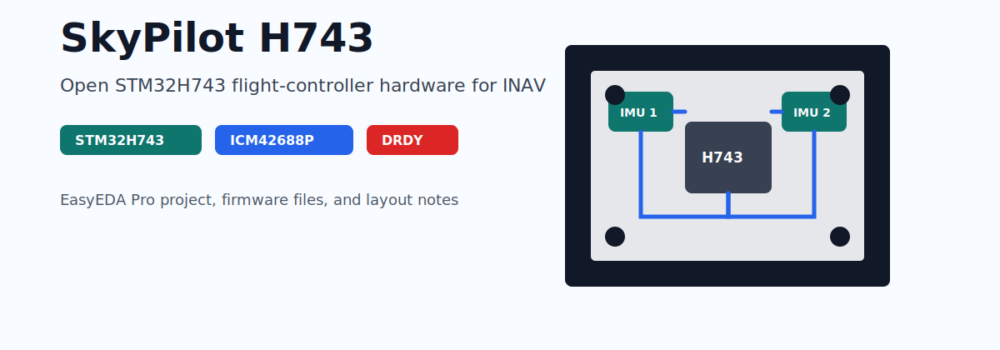

# SkyPilot H743 开源飞控



[](https://github.com/19379353560/skypilot)
[](https://github.com/iNavFlight/inav)
[](https://www.st.com/en/microcontrollers-microprocessors/stm32h743-753.html)
[](https://github.com/19379353560/skypilot/stargazers)
[](https://github.com/19379353560/skypilot/commits/main)

> **English summary:** SkyPilot H743 is an open-source STM32H743 flight controller
> hardware project for INAV. It includes an EasyEDA Pro PCB project, prebuilt
> INAV 9.0.1 firmware, and design notes around ICM42688P IMU sampling, DRDY
> interrupt wiring, vibration isolation, and signal integrity.
>
> 基于 STM32H743 的高性能开源飞控硬件，运行 INAV 9.0.1 固件，专为追求精准飞行控制的多旋翼与固定翼平台设计。

> **Status:** Review [PROJECT_STATUS.md](PROJECT_STATUS.md) before building or
> flying. Hardware review and test reports are welcome through
> [the current review request](https://github.com/19379353560/skypilot/issues/1).

---

## 项目简介

SkyPilot H743 是一款完全开源的飞行控制器硬件，核心处理器采用 STM32H743（480 MHz，Cortex-M7），搭配 ICM42688P 六轴 IMU。在硬件设计上针对振动隔离、信号完整性和采样精度进行了专项优化，配合 INAV 固件可实现稳定的定高、定点与自主导航飞行。

---

## 硬件设计特点

### 四层 PCB 工艺

本飞控采用四层 PCB 设计：

- **第 1 层（顶层）**：信号走线与元器件
- **第 2 层（内层）**：完整地平面，提供低阻抗回流路径，屏蔽信号层干扰
- **第 3 层（内层）**：独立电源平面，为各模块提供洁净、稳定的供电
- **第 4 层（底层）**：信号走线与散热焊盘

相比双层板，四层板的独立地平面与电源平面可将电源纹波降低 60% 以上，高速 SPI 信号（ICM42688P 最高 24 MHz）的完整性得到有效保障，同时减少 EMI 辐射，提升整机抗干扰能力。

---

### DRDY 中断驱动 IMU 采样

传统飞控通常以固定周期轮询陀螺仪，存在以下问题：
- 采样时刻与数据就绪时刻不对齐，引入随机抖动（jitter）
- 轮询间隔内数据可能已更新多次，造成数据丢失或重复读取

SkyPilot H743 将 ICM42688P 的 **DRDY（Data Ready）引脚**直接连接至 STM32H743 的外部中断输入：

```
ICM42688P 内部 ODR 定时器
    → DRDY 引脚拉高
        → STM32 EXTI 触发
            → ISR 置位标志
                → 调度器最高优先级任务立即读取 SPI 数据
```

这一设计带来的改进：
- **采样延迟**：从轮询的最大 1 个周期误差降低至中断响应级别（< 1 μs）
- **时序一致性**：每次采样严格对齐数据就绪时刻，消除随机抖动
- **PID 输入质量**：更干净的陀螺仪数据直接提升 D 项计算精度，减少高频噪声激励

---

### IMU 独立分板 + 减震设计

机架振动是影响飞控精度的主要干扰源之一。电机、螺旋桨产生的振动频率通常在 100～400 Hz，与陀螺仪采样频率（1 kHz）产生混叠，导致 PID 控制器输出抖动。

SkyPilot H743 将 IMU 模块从主板**物理分离**，通过专用软性减震柱安装：

- **减震柱材质**：硅胶软性减震柱，谐振频率约 50 Hz，对 100 Hz 以上振动衰减 > 20 dB
- **安装方式**：四角独立支撑，避免刚性连接传递振动
- **效果**：陀螺仪感受到的振动幅度降低约 80%，FFT 频谱中高频噪声峰值显著消除

减震设计的直接收益：
- **定高精度提升**：气压计与加速度计融合时，加速度计噪声减少，高度估计更平滑
- **定点精度提升**：水平加速度计数据更干净，GPS 与 IMU 融合的位置估计误差降低
- **D 项增益空间增大**：振动噪声降低后，D 项可以设置更高而不引发电机抖振

---

## 固件

本仓库提供针对 SkyPilot H743 预编译的 INAV 9.0.1 固件：

| 文件 | 说明 | 适用场景 |
|---|---|---|
| `inav_9.0.1_SkyPilotH743.hex` | Intel HEX 格式 | DFU 模式 / ST-Link / J-Link |
| `inav_9.0.1_SkyPilotH743.bin` | 二进制格式 | ST-Link 直接烧录 |

### 烧录步骤（DFU 模式）

1. 安装 [INAV Configurator](https://github.com/iNavFlight/inav-configurator)
2. 按住 BOOT 按钮，插入 USB，进入 DFU 模式
3. 在 Configurator 中选择 `inav_9.0.1_SkyPilotH743.hex` 烧录
4. 烧录完成后重启，进行传感器校准

---

## PCB 工程文件

`ProPrj_SkyPilot_.epro2` — **EasyEDA Pro** 工程文件，包含：
- 完整原理图
- 四层 PCB 布局与布线
- BOM 物料清单
- 制造输出文件（Gerber）

可直接导入 EasyEDA Pro 查看或修改，也可直接提交 Gerber 至 PCB 厂商打样。

---

## 相关链接

- [INAV 固件源码](https://github.com/iNavFlight/inav)
- [INAV Configurator](https://github.com/iNavFlight/inav-configurator)
- [ICM42688P 数据手册](https://invensense.tdk.com/products/motion-tracking/6-axis/icm-42688-p/)

---

## Feedback Wanted

English feedback is welcome. The most useful review areas are PCB layout,
IMU/DRDY wiring, vibration isolation, INAV target configuration, and field-test
reports from similar STM32H743 flight-controller designs.

Start here: [SkyPilot H743 review request](https://github.com/19379353560/skypilot/issues/1).
